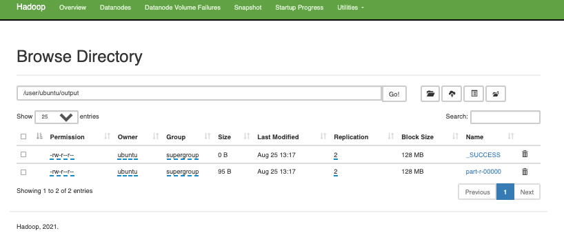

# hadoop-on-aws
In this repository I show you how to setup a plain Hadoop cluster, in particular using EC2 machines (that lives in the same subnet).
But you con consider it for a plain cluster of on premis machines.

## Single machine cluster set up
This part is expired from these tutorials:
- http://hadoop.apache.org/docs/current/hadoop-project-dist/hadoop-common/SingleCluster.html
- https://www.edureka.co/blog/install-hadoop-single-node-hadoop-cluster

Start.
- Download hadoop: `wget https://apache.osuosl.org/hadoop/common/stable/hadoop-3.3.1.tar.gz`
- unpack the tar: `tar -xvf hadoop-3.3.1.tar.gz`
- Install _java_ `sudo apt-get -y install openjdk-8-jdk-headless`

From now assume that the upacked tar forlder name is HADOOP_FILES
- Change the `.bashrc` file adding these rows:
   ```
   #set hadoop home
   export HADOOP_HOME=$HOME/HADOOP_FILES
   export HADOOP_CONF_DIR=$HOME/HADOOP_FILES/etc/hadoop
   export HADOOP_MAPRED_HOME=$HOME/HADOOP_FILES
   export HADOOP_COMMON_HOME=$HOME/HADOOP_FILES
   export HADOOP_HDFS_HOME=$HOME/HADOOP_FILES
   export YARN_HOME=$HOME/HADOOP_FILES
   export PATH=$PATH:$HOME/HADOOP_FILES/bin

   # set java home
   export JAVA_HOME=/usr/lib/jvm/java-8-openjdk-amd64
   export PATH=/usr/lib/jvm/java-8-openjdk-amd64:$PATH
   export PDSH_RCMD_TYPE=ssh
    
- Run `source .bashrc` for reload the file
- modify the configurations file that are in `HADOOP_FILES/etc/hadoop/`
   -  for the file `core-site.xml` (it contains configuration settings of Hadoop core such as I/O settings that are common to HDFS & MapReduce)
      ```
      <configuration>
      <property>
      <name>fs.default.name</name>
      <value>hdfs://localhost:9000</value>
      </property>
      </configuration>
      ```

   -  for the file `hdfs-site.xml` (which is the file with configuration settings of HDFS daemons (i.e. NameNode, DataNode, Secondary NameNode). It also includes the replication factor and block size of HDFS.)
      ```
      <configuration>
      <property>
      <name>dfs.replication</name>
      <value>1</value>
      </property>
      <property>
      <name>dfs.permission</name>
      <value>false</value>
      </property>
      </configuration>
      ```
      
   -  for the file `yarn-site.xml` (it contains configuration settings of MapReduce application like number of JVM that can run in parallel, the size of the mapper and the reducer process,  CPU cores available for a process, etc.)
      ```
      <configuration>
      <property>
      <name>yarn.nodemanager.aux-services</name>
      <value>mapreduce_shuffle</value>
      </property>
      <property>
      <name>yarn.nodemanager.auxservices.mapreduce.shuffle.class</name>
      <value>org.apache.hadoop.mapred.ShuffleHandler</value>
      </property>
      </configuration>
      ```
      
   -  for the file `mapred-site.xml` (cit ontains configuration settings of ResourceManager and NodeManager like application memory management size, the operation needed on program & algorithm, etc.)
      ```
      <configuration>
      <property>
      <name>mapreduce.framework.name</name>
      <value>yarn</value>
      </property>
      <property>
      <name>yarn.app.mapreduce.am.env</name>
      <value>HADOOP_MAPRED_HOME=/home/ubuntu/HADOOP_FILES</value>
      </property>
      <property>
      <name>mapreduce.map.env</name>
      <value>HADOOP_MAPRED_HOME=/home/ubuntu/HADOOP_FILES</value>
      </property>
      <property>
      <name>mapreduce.reduce.env</name>
      <value>HADOOP_MAPRED_HOME=/home/ubuntu/HADOOP_FILES</value>
      </property>
      </configuration>
      ```
    - for `hadoop-env.sh` add `export JAVA_HOME=/usr/lib/jvm/java-8-openjdk-amd64`
    
Open ports 9870 and 8088 to the IPs that you want to see web UIs of hadoop

### Run the single machine cluster
From the HADOOPFILE FOLDER
- `./hadoop-daemon.sh start namenode` for start name node
- `/hadoop-daemon.sh start datanode` for start the data node
- `./yarn-daemon.sh start resourcemanager` for start the resource manager
- `./yarn-daemon.sh start nodemanager` for start the node manager
- `./mr-jobhistory-daemon.sh start historyserver` for start the history server

### Some screens 
Overview: 
Cluster Datanode: 

HDFS interface (http://machineIP:9870/dfshealth.html): 
     


## Cluster with more than a node set up
For this part I follow this two tutorials and some stackoverflow questions:
- https://www.edureka.co/blog/setting-up-a-multi-node-cluster-in-hadoop-2.X
- http://hadoop.apache.org/docs/current/hadoop-project-dist/hadoop-common/ClusterSetup.html

Start.

Download and upack the tar file in each machine, and install some programs:
- Download hadoop: `wget https://apache.osuosl.org/hadoop/common/stable/hadoop-3.3.1.tar.gz`
- unpack the tar: `tar -xvf hadoop-3.3.1.tar.gz`
- Install _java_ `sudo apt-get -y install openjdk-8-jdk-headless`
- `sudo apt install firewalld`
- `sudo apt install net-tools`

Disable firewall:
- `sudo systemctl stop firewalld`
- `sudo systemctl disable firewalld`
- `sudo service firewalld stop`
- `sudo ufw disable`

Change `/etc/hosts` file adding private IPs of all cluster machines like follow (in AWS the private ip not changes and the machines are in the same subnet)
```
172.31.4.195 master
172.31.11.53 slave1
172.31.5.5 slave2
```
and other slaves that you have.

From now assume that the upacked tar forlder name is HADOOP_FILES

Restart host service: `service sshd restart`

- Change the `.bashrc` file adding these rows:
  ```
  export HADOOP_HOME=$HOME/server/hadoop-3.3.1
  export HADOOP_CONF_DIR=$HOME/HADOOP_FILES/etc/hadoop
  export HADOOP_MAPRED_HOME=$HOME/HADOOP_FILES
  export HADOOP_COMMON_HOME=$HOME/HADOOP_FILES
  export HADOOP_HDFS_HOME=$HOME/HADOOP_FILES
  export HADOOP_YARN_HOME=$HOME/HADOOP_FILES
  export PATH=$PATH:$HOME/HADOOP_FILES/bin

  export JAVA_HOME=/usr/lib/jvm/java-8-openjdk-amd64
  export PATH=/usr/lib/jvm/java-8-openjdk-amd64:$PATH
  ```

- Run `source .bashrc` for reload the file

Open ports:
- 9870 and 8088 of the master to the IPs that you want to see web UIs of hadoop
- 0 - 65535 between hosts for communicate each other

- modify the configurations file that are in `HADOOP_FILES/etc/hadoop/`
      -  for the file `core-site.xml` (it contains configuration settings of Hadoop core such as I/O settings that are common to HDFS & MapReduce) for both _master_ and _slaves_
      ```
      <configuration>
      <property>
      <name>fs.default.name</name>
      <value>hdfs://master:9000</value>
      </property>
      </configuration>
      ```

   -  for the file `hdfs-site.xml` (which is the file with configuration settings of HDFS daemons (i.e. NameNode, DataNode, Secondary NameNode). It also includes the replication factor and block size of HDFS.)
      
      for _master_
      ```
      <configuration>
      <property>
      <name>dfs.replication</name>
      <value>2</value>
      </property>
      <property>
      <name>dfs.permissions</name>
      <value>false</value>
      </property>
      <property>
      <name>dfs.namenode.name.dir</name>
      <value>/home/ubuntu/server/hadoop-3.3.1/namenode</value>
      </property>
      <property>
      <name>dfs.datanode.data.dir</name>
      <value>/home/ubuntu/server/hadoop-3.3.1/datanode</value>
      </property>
      </configuration>
      ```
      
      for _slaves_
      ```
      <configuration>
      <property>
      <name>dfs.replication</name>
      <value>2</value>
      </property>
      <property>
      <name>dfs.permissions</name>
      <value>false</value>
      </property>
      <property>
      <name>dfs.datanode.data.dir</name>
      <value>/home/ubuntu/server/HADOOP_FILES/datanode</value>
      </property>
      </configuration>
      ```
      
   -  for the file `yarn-site.xml` (it contains configuration settings of MapReduce application like number of JVM that can run in parallel, the size of the mapper and the reducer process,  CPU cores available for a process, etc.) for both _master_ and _slaves_
      ```
      <configuration>
      <property>
      <name>yarn.nodemanager.aux-services</name>
      <value>mapreduce_shuffle</value>
      </property>
      <property>
      <name>yarn.nodemanager.auxservices.mapreduce.shuffle.class</name>
      <value>org.apache.hadoop.mapred.ShuffleHandler</value>
      </property>
      </configuration>
      ```
      
   -  for the file `mapred-site.xml` (cit ontains configuration settings of ResourceManager and NodeManager like application memory management size, the operation needed on program & algorithm, etc.) for both _master_ and _slaves_
      ```
      <configuration>
      <property>
      <name>mapreduce.framework.name</name>
      <value>yarn</value>
      </property>
      <property>
      <name>yarn.app.mapreduce.am.env</name>
      <value>HADOOP_MAPRED_HOME=/home/ubuntu/HADOOP_FILES</value>
      </property>
      <property>
      <name>mapreduce.map.env</name>
      <value>HADOOP_MAPRED_HOME=/home/ubuntu/HADOOP_FILES</value>
      </property>
      <property>
      <name>mapreduce.reduce.env</name>
      <value>HADOOP_MAPRED_HOME=/home/ubuntu/HADOOP_FILES</value>
      </property>
      </configuration>
      ```
   - for `hadoop-env.sh` for both _master_ and _slaves_ add `export JAVA_HOME=/usr/lib/jvm/java-8-openjdk-amd64`
      
   - create the `masters` file (contains address of master nodes) for both _master_ and _slaves_ as 
      ```
      master
      ```
      
  - create the `workers` file (contains address of worker nodes, in hadoop 2 this file is named `slaves`) as 
           for _master_
      ```
      master
      slave1
      slave2
      ```
      
      for _slaves_
      ```
      slave1
      slave2
      ```

      also remember to add the other slaves that are in `/etc/hosts`
      
### Start the cluster
- the first time run `hadoop namenode -format`
- `HADOOP_FILES/sbin/start-all.sh`

### Stop the cluster
- `HADOOP_FILES/sbin/stop-all.sh`

### Before restart (ONLY if there are problems)
- remember to use `jps` command in the nodes for see the active services
- `rm -r /tmp/` (consider to delete only the hadoop folders inside /tmp)
- `rm -r datanode/current` in each datanode and in the name node
- `rm -r namenode/current` in the name node

### Some screens 
Cluster Datanodes: 

Hadoop interface (http://master:8088): 
     

HDFS interface (http://master:9870/dfshealth.html): 
     
 
# Example of a job execution and HDFS interaction
An example of a job is in `WordCount.java`, it counts for each word in a hdfs folder the number of occurrences.

We interact with hdfs with the command `hdfs dfs`, for example:
```
# Explore HDFS directories with –ls
hdfs dfs -ls /
# Create a bigdata folder in your HDFS home
hdfs dfs -mkdir bigdata
# Create a dummy file in your folder in the local file system
echo 'This is a dummy file' > dummy.txt
# Put the dummy file to your bigdata folder in HDFS
hdfs dfs -put bigdata/dummy.txt
# Get the job file from the virtual cluster's HDFS
hdfs dfs –get /path/WordCount.java
# Print hdfs file 
hdfs dfs -cat mapreduce/output/* | head -n 30
```

After obtain the jar with gradle we run it with: `hadoop jar jarName.jar WordCount inputHDFSFoder outputHDFSFolder`

The result of the running:


The source code: 